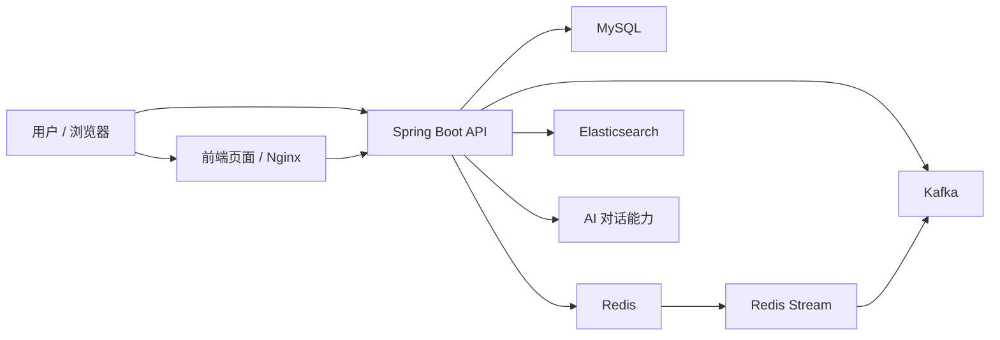
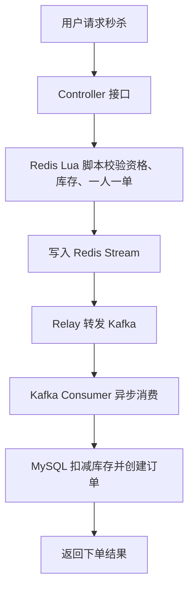
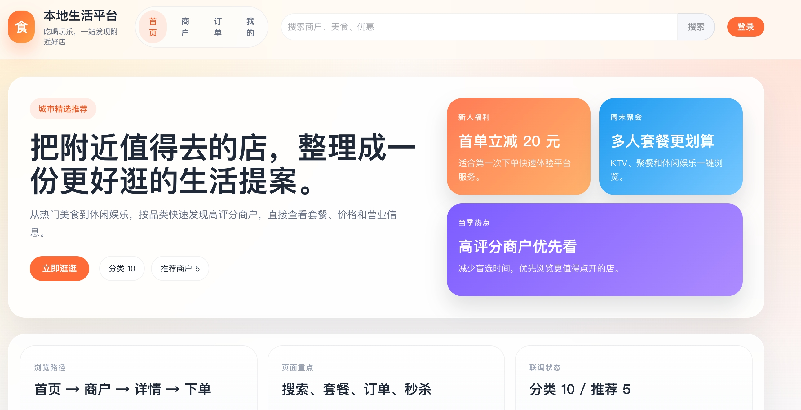
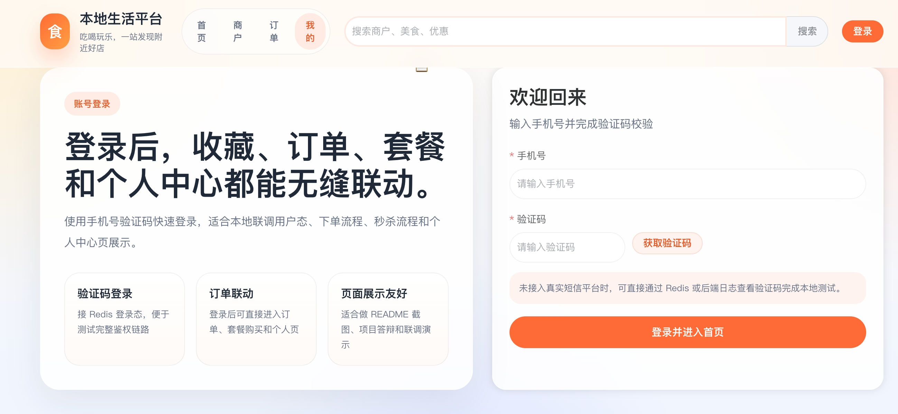
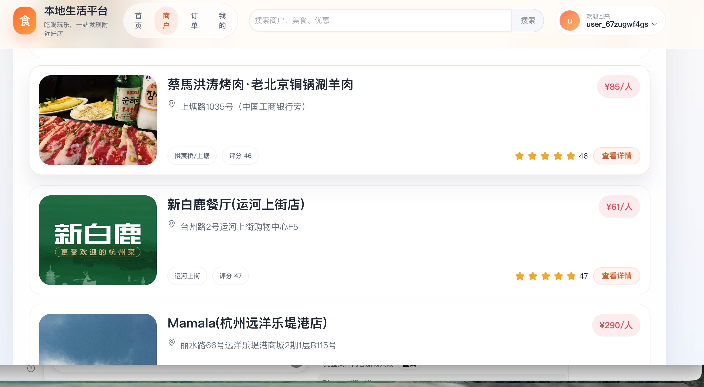
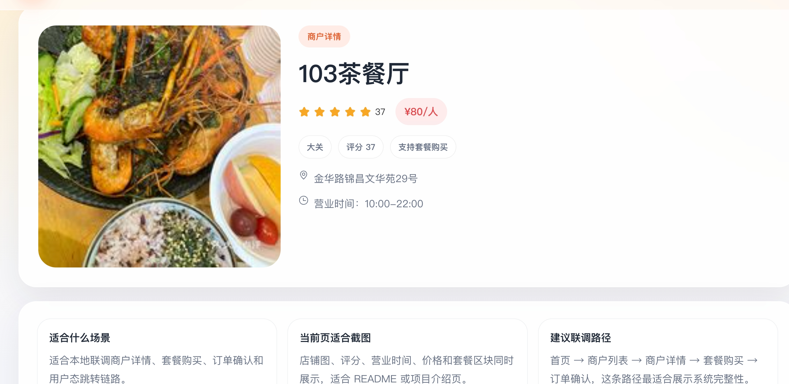
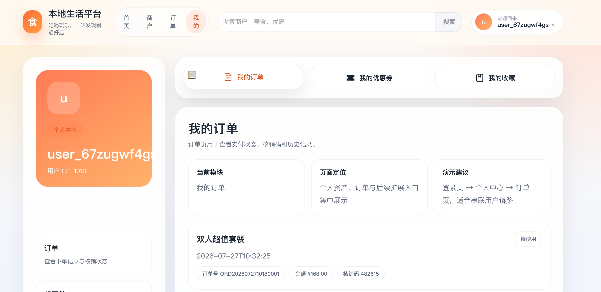
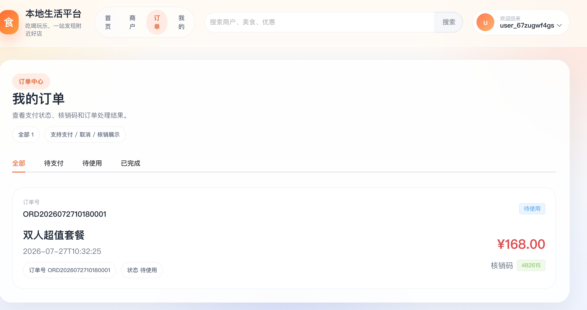

# 大众点评仿站 / 本地生活服务项目

一个基于 Spring Boot、Redis、MySQL、Kafka、Elasticsearch 的本地生活服务项目，围绕“登录鉴权、商户浏览、探店博客、关注 Feed、优惠券秒杀、套餐下单、搜索推荐”这些典型业务场景展开。

这个仓库不只是一个 CRUD Demo，更偏向“可用于练手高并发与工程化能力”的综合项目：

- 有完整的用户、商户、博客、订单、秒杀、搜索、客服等业务模块
- 有 Redis Lua、Redis Stream、Kafka、Redisson、二级缓存、接口限流等中间件实战
- 有本地启动脚本、数据库初始化脚本、压测脚本、自动化测试脚本
- 有面试材料、测试记录、设计文档，适合做项目复盘和简历扩展

## README 导航

- 线上演示
- 项目亮点
- 系统展示
- 技术栈
- 功能模块
- 核心架构说明
- 环境要求
- 快速开始
- 启动后如何验证
- 测试与压测
- 文档导航

## 线上演示

- **地址**：http://8.156.94.216/ （阿里云 ECS，nginx + systemd 托管，全链路开机自启）
- **登录方式**：支持手机号或邮箱验证码登录。演示环境走邮箱通道（SMTP 免费），输入自己的邮箱 → 收码登录；未配置邮箱时验证码通道可切换为日志模式
- **压测成绩**：秒杀链路 1000/1000 订单精确售罄（零超卖、零重复）；热门博客接口经 N+1 治理后吞吐提升 5 倍（82 → 406 RPS）
- **运维能力**：进程崩溃 17s 自愈、每小时七项指标健康巡检、异常飞书群告警、MySQL 每日备份（详见 `docs/design/server-ops-runbook.md`）
- **一键迁移**：全栈容器化交付（`deploy/docker-compose.yml`），任意 Docker 主机 `git clone + 填 .env + compose up` 5 分钟重建全套（含数据库自动初始化），详见 [`docs/design/migration-guide.md`](docs/design/migration-guide.md)

> 环境说明：HTTP 访问下浏览器定位不可用，附近商户功能自动降级为"杭州市中心"定位（演示数据均位于杭州）。

## 项目亮点

- 手机验证码登录，登录态存储在 Redis
- **手机号/邮箱双通道验证码**（SMTP 免费通道 + 日志通道可配置切换），四层频控防轰炸：60s 重发冷却、单号日限、单 IP 日限、错 5 次作废
- Redis 多数据结构实践：String、Set、ZSet、Bitmap、GEO
- 商户查询使用 Caffeine + Redis 两级缓存
- **附近商户距离排序**：Redis GEO 按分类存储坐标，支持按用户位置就近排序并展示距离
- 秒杀链路采用 Redis Lua + Redis Stream + Kafka + MySQL 的组合方案
- 通过 Lua、唯一索引、乐观锁、Redisson 分布式锁共同防止超卖和重复下单
- 通过 Redis Pub/Sub 广播实现多节点本地缓存失效同步
- 基于自定义注解 + AOP + Redis 实现轻量级接口限流
- 集成 Elasticsearch，实现商户搜索、高亮、距离排序；**结果短 TTL 缓存 + ES 故障自动降级 DB 查询**
- 提供 API / UI 自动化测试与压测脚本
- 引入 Micrometer / Actuator 进行基础监控与指标暴露

## 系统展示

### 系统整体结构



### 核心业务场景

- 用户登录：验证码发送 → Redis 存验证码 → 登录成功后生成 Token
- 商户浏览：优先查本地缓存 / Redis 缓存，未命中再落到 MySQL
- 商户搜索：请求进入 Elasticsearch，支持高亮和距离排序
- 博客 Feed：关注关系 + 推送流，支持点赞、发布、查询
- 秒杀下单：Redis Lua 预校验 → Redis Stream / Kafka → MySQL 最终落库
- 套餐订单：创建订单 → 支付 / 取消 → 核销 → 状态流转

### 秒杀链路可视化



### 页面展示

下面这些页面截图来自本地真实运行环境，便于快速理解项目的页面风格和业务链路。

#### 首页



#### 登录页



#### 商户列表页



#### 商户详情页



#### 用户中心页



#### 订单页



## 技术栈

### 后端

- Java 8 语法风格
- Spring Boot 2.3.12.RELEASE
- Spring MVC
- MyBatis-Plus
- Spring Data Redis
- Redisson
- Spring Kafka
- Spring Boot Actuator
- Knife4j
- Hutool

### 中间件

- MySQL
- Redis
- Kafka
- Elasticsearch
- Nginx

### 并发与缓存

- Caffeine 本地缓存
- Redis 分布式缓存
- Redis Lua
- Redis Stream
- Redisson 分布式锁
- 自定义限流

### 测试与脚本

- JUnit 5
- PyTest
- Selenium
- Allure
- k6 / Python 压测脚本

## 功能模块

### 用户模块

- 发送验证码（手机号 / 邮箱双通道，自动识别）
- 验证码登录（60s 重发冷却、单号/单 IP 日限、错 5 次作废、一次性使用）
- Token 登录态管理
- 退出登录
- 用户资料查询
- 用户签到与连续签到统计

### 商户模块

- 商户详情查询
- 按类型分页查询商户
- **按类型 + 用户坐标就近排序（Redis GEO 距离计算）**
- 按关键字查询商户
- 商户类型列表查询
- 商户数据同步到 Elasticsearch

### 博客 / Feed 模块

- 发布探店博客
- 查询热门博客
- 博客点赞
- 查询点赞用户
- 关注后 Feed 流
- 评论相关能力

### 关注模块

- 关注 / 取关用户
- 判断是否已关注
- 查询共同关注

### 优惠券 / 秒杀模块

- 普通优惠券新增与查询
- 秒杀券新增
- 秒杀下单
- 异步订单落库
- 重试与失败补偿

### 套餐 / 订单 / 核销模块

- 商家发布套餐
- 套餐上下架管理
- 套餐库存管理
- 统一订单管理
- 订单状态流转
- 订单取消与库存回滚
- 核销码生成与商家核销

### 搜索模块

- 商户全文搜索
- 搜索结果高亮
- 地理位置距离排序
- 搜索结果 Redis 短 TTL 缓存（压测命中后 525ms → 49ms）
- ES 故障自动降级数据库模糊查询
- Canal 同步扩展支持

### 智能客服模块

- AI 多轮对话
- 意图识别
- FAQ / 商户信息问答
- 对话历史记录
- AI 失败降级
- 敏感词与 Prompt 注入防护

## 核心架构说明

### 1. 登录与鉴权

用户通过验证码登录，Redis 中保存：

- 验证码：`login:code:{phone}`
- 登录 Token：`login:token:{token}`

后端通过拦截器完成：

- Token 刷新
- 登录校验
- 用户上下文透传

### 2. 商户缓存架构

商户数据采用三级访问路径：

```text
浏览器 / App
    ↓
Spring Boot
    ↓
L1: Caffeine 本地缓存
    ↓
L2: Redis 分布式缓存
    ↓
L3: MySQL
```

重点解决的问题：

- 缓存穿透：空值缓存
- 缓存击穿：互斥锁 / 逻辑过期
- 热点数据加速：本地缓存
- 多节点一致性：Redis Pub/Sub 通知失效

### 3. 秒杀链路

这是项目里最核心的高并发场景：

```text
用户请求
-> Controller
-> Redis Lua 校验库存 / 一人一单 / 预扣库存
-> 写入 Redis Stream
-> Relay 转发 Kafka
-> Kafka Consumer 异步落库
-> MySQL 扣减最终库存并创建订单
```

核心思路：

- Redis Lua 保证资格校验与预扣减原子性
- Redis 负责快速拦截，不作为订单最终真相来源
- Kafka 负责削峰、解耦、重试、死信分流
- MySQL 唯一索引和库存条件更新做最终一致性兜底
- Redisson 进一步保护同一用户并发下单

### 4. 接口限流

限流能力基于：

- 自定义注解 `@RateLimit`
- Spring AOP 切面拦截
- Redis 固定窗口计数
- 冷却时间控制

已保护的典型接口包括：

- `/user/code`
- `/user/login`
- `/voucher-order/seckill/{id}`

## 项目结构

```text
dazhaongdianping_moni
├─ src/main/java/com/hmdp
│  ├─ annotation      # 自定义注解
│  ├─ aspect          # AOP 切面，如限流
│  ├─ canal           # Canal 相关逻辑
│  ├─ config          # Spring 配置
│  ├─ controller      # 接口层
│  ├─ dto             # DTO / VO
│  ├─ entity          # 实体类
│  ├─ enums           # 枚举
│  ├─ exception       # 异常处理
│  ├─ mapper          # MyBatis-Plus Mapper
│  ├─ monitor         # 指标与监控
│  ├─ mq              # Redis Stream / Kafka 消息链路
│  ├─ service         # 服务接口
│  ├─ service/impl    # 服务实现
│  └─ utils           # 工具类
├─ src/main/resources
│  ├─ application.yaml
│  ├─ application-local.example.yaml
│  ├─ db              # 建表及增量脚本
│  ├─ mapper
│  ├─ seckill.lua
│  └─ seckill_rollback.lua
├─ scripts            # 本地启动、压测、验证脚本
├─ tests              # Python 自动化测试
├─ heima_qianduan     # 前端资源 / Nginx 资源
├─ docs               # 设计、测试、实施文档
└─ interview          # 面试资料与讲解材料
```

## 环境要求

建议本地准备以下环境：

- JDK 17 / 21
- Maven 3.9+
- MySQL 8+
- Redis 6+
- Kafka 3+
- Elasticsearch 7.17+

说明：

- 项目源码本身主要使用 Java 8 风格写法
- 该仓库已在本地使用 JDK 21 运行验证
- 如果使用较新的 JDK，建议直接使用仓库自带脚本启动

推荐环境组合：

| 组件 | 推荐版本 | 说明 |
| --- | --- | --- |
| JDK | 21 | 本地已验证可运行 |
| Maven | 3.9+ | 用于构建和启动 |
| MySQL | 8+ | 存储业务数据 |
| Redis | 6+ / 7+ / 8+ | 登录、缓存、限流、秒杀 |
| Kafka | 3+ / 4+ | 异步削峰、订单消费 |
| Elasticsearch | 7.17.x | 商户搜索 |
| Docker | 最新版 | 推荐用于启动 Elasticsearch |

## 快速开始

> **服务器部署**（生产形态，推荐）：本项目已在阿里云 ECS 完整部署（nginx + systemd + Docker），部署清单、配置项与运维操作见 👉 [`docs/design/server-ops-runbook.md`](docs/design/server-ops-runbook.md)。以下为本地开发环境搭建。

### 1. 克隆项目

```bash
git clone git@github.com:1code-lover/dazhaongdianping_moni.git
cd dazhaongdianping_moni
```

### 2. 初始化数据库

先创建数据库：

```sql
CREATE DATABASE IF NOT EXISTS hmdp DEFAULT CHARACTER SET utf8mb4;
```

然后执行这些脚本：

- `src/main/resources/db/hmdp.sql`
- `src/main/resources/db/combo_order_tables.sql`
- `src/main/resources/db/shop_apply_tables.sql`
- `src/main/resources/db/chat_tables.sql`
- `src/main/resources/db/voucher_order_fail_task.sql`
- `src/main/resources/db/voucher_order_fail_task_failure_type.sql`
- `src/main/resources/db/voucher_order_unique_index.sql`

说明：

- 部分旧脚本在新版本 MySQL 下可能受严格模式影响
- 如遇到 `0000-00-00 00:00:00` 默认值报错，可以临时关闭严格模式后导入

### 3. 配置本地环境

公共配置文件：

- `src/main/resources/application.yaml`

本地配置示例：

- `src/main/resources/application-local.example.yaml`

推荐做法：

1. 复制 `application-local.example.yaml`
2. 重命名为 `application-local.yaml`
3. 按本地环境修改数据库、Redis、Kafka、AI 等配置

说明：

- `application-local.yaml` 已加入 `.gitignore`
- 不要把本地私有配置提交到仓库

### 4. 启动依赖服务

仓库已提供一键启动脚本：

```bash
./scripts/start-services.sh
```

会启动：

- MySQL
- Redis
- Kafka

也可以分别手动启动：

```bash
brew services start mysql
brew services start redis
brew services start kafka
```

如果你本地用 Docker 启动 Elasticsearch，可以参考：

```bash
docker run -d \
  --name elasticsearch \
  -p 9200:9200 \
  -p 9300:9300 \
  -e "discovery.type=single-node" \
  -e "xpack.security.enabled=false" \
  elasticsearch:7.17.25
```

如果容器已经创建过，也可以直接启动已有容器：

```bash
docker start elasticsearch
```

### 依赖服务启动顺序

推荐顺序如下：

1. MySQL
2. Redis
3. Kafka
4. Elasticsearch
5. Spring Boot 后端
6. 前端 / Nginx

### 5. 启动后端服务

推荐直接使用仓库脚本：

```bash
./scripts/start-app.sh
```

脚本会：

- 自动切到项目根目录
- 优先尝试使用本机 JDK 21
- 默认使用 `local` profile 启动

如果你想手动启动，也可以执行：

```bash
mvn spring-boot:run
```

后端默认地址：

```text
http://127.0.0.1:8081
```

健康检查：

```text
http://127.0.0.1:8081/actuator/health
```

### 6. 启动前端

前端资源位于：

- `heima_qianduan/`

如果使用 Nginx 静态资源方式启动，请按你本机的 Nginx 环境处理。仓库中保留了前端相关资源与资料，适合本地联调和页面验证。

## 启动后如何验证

项目启动后，建议按下面顺序验证：

### 1. 检查依赖服务

```bash
brew services list | grep -E "mysql|redis|kafka"
curl http://127.0.0.1:9200
```

### 2. 检查后端健康状态

```bash
curl http://127.0.0.1:8081/actuator/health
```

正常情况下应该看到：

- `db.status = UP`
- `redis.status = UP`
- `elasticsearch.status = UP`

### 3. 验证搜索链路

先执行一次同步：

```bash
curl -X POST http://127.0.0.1:8081/shop/sync
```

再执行搜索：

```bash
curl -G http://127.0.0.1:8081/shop/search \
  --data-urlencode "keyword=103" \
  --data-urlencode "current=1" \
  --data-urlencode "size=5"
```

如果返回类似 `103茶餐厅` 的结果，说明搜索链路已经打通。

### 4. 常用访问地址

| 模块 | 地址 | 说明 |
| --- | --- | --- |
| 后端接口 | `http://127.0.0.1:8081` | Spring Boot 服务 |
| 健康检查 | `http://127.0.0.1:8081/actuator/health` | 查看服务依赖是否正常 |
| Prometheus 指标 | `http://127.0.0.1:8081/actuator/prometheus` | 查看监控指标 |
| Elasticsearch | `http://127.0.0.1:9200` | 查看 ES 是否启动 |

### 5. 首次联调建议

建议优先验证下面几个接口：

- `POST /user/code`：发送验证码
- `POST /user/login`：验证码登录
- `GET /shop/{id}`：查询商户详情
- `GET /shop/of/type`：按类型分页查询商户
- `POST /voucher-order/seckill/{id}`：测试秒杀主链路

### 6. 日志查看

项目日志默认会输出到控制台，同时当前配置里也写入：

- `app.log`

如果启动失败，优先检查：

- MySQL 账号密码是否正确
- Redis 是否设置了密码但配置没同步
- Kafka / Elasticsearch 是否已启动
- 本地 JDK 是否与 Maven 运行时一致

## 测试与压测

### Java 测试

按需执行：

```bash
mvn test
```

如需运行指定测试：

```bash
mvn "-Dtest=VoucherOrderServiceImplTransactionTest,CacheClientLockTest,RedisStreamToKafkaRelayTest,ConfigurationTemplateSanitizationTest" test
```

### Python 自动化测试

```bash
pytest -m api --base-url http://127.0.0.1:8081
```

```bash
pytest -m ui --ui-base-url http://127.0.0.1:8080 --headless
```

```bash
pytest --base-url http://127.0.0.1:8081 --ui-base-url http://127.0.0.1:8080 --alluredir reports/allure-results
```

如果安装了 Allure：

```bash
allure serve reports/allure-results
```

## 开发规范

本项目遵循以下规范文档：

- [AGENTS.md](AGENTS.md) — 项目开发规范（流程、注释、提交、代码风格）
- [DOCS.md](DOCS.md) — 文档管理规范（目录结构、命名、归档策略）
- [TESTING.md](TESTING.md) — 测试规范
- [TOOLS.md](TOOLS.md) — 工具使用指南

### 秒杀压测脚本

仓库中已经提供压测相关脚本：

- `scripts/loadtest_seckill.py`
- `scripts/seckill-load.k6`
- `scripts/verify-seckill-rollback-lua.sh`

适合验证：

- 秒杀成功率
- 是否超卖
- 限流是否生效
- Kafka 消费链路是否正常
- 失败补偿是否生效

## 文档导航

仓库中不仅有源码，也沉淀了不少过程文档，适合继续打磨成“项目说明 + 面试讲稿 + 测试材料”。

### docs

- 设计方案
- 测试计划
- 压测记录
- 实施清单

### interview

- 面试问答
- 项目讲解资料
- PDF 汇总材料

### tests

- API 自动化测试
- UI 自动化测试

## 适合拿来练什么

- Spring Boot 项目分层与接口设计
- Redis 在登录、签到、Feed、GEO、限流、秒杀中的应用
- 高并发秒杀链路设计
- Kafka 异步削峰与失败补偿
- Elasticsearch 搜索接入
- 二级缓存设计与一致性处理
- 本地项目启动、联调、压测与问题排查
- 面试项目表达与技术亮点沉淀

## 后续可继续优化的方向

- 将限流规则进一步配置化
- 增加网关层或 Nginx 层粗粒度限流
- 完善监控告警与链路追踪
- 增加更多集成测试和压测报告
- 清理部分历史资料与临时文件
- 补充标准开源协议和更规范的发布说明

## License

当前仓库尚未声明正式开源协议。

如果后续计划长期公开维护，建议补充一个明确的 `LICENSE` 文件。
